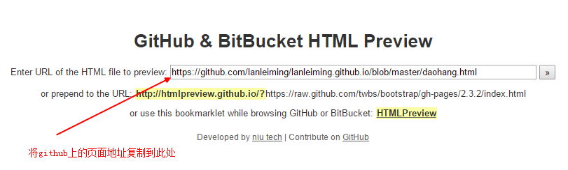
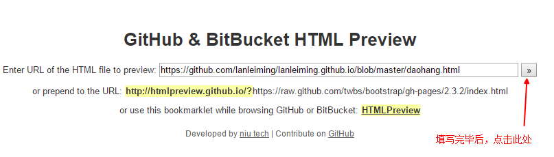

# Github-help
+ Github 操作指南，整理收集一些常用的get
 

# 一、Github 博客、页面搭建、预览等方法
+ 在Github Pages搭建自己写的页面
URL:[http://www.cnblogs.com/lijiayi/p/githubpages.html](http://www.cnblogs.com/lijiayi/p/githubpages.html)
 
+ 在线预览Github 页面方法.可以通这个网站，直接在线预览html页面
URL：[http://htmlpreview.github.io] (http://htmlpreview.github.io)
操步骤

# 二、Git命令目录
### 1.常用命令
+ $ git clone  //本地如果无远程代码，先做这步，不然就忽略
+ $ cd //定位到你blog的目录下
+ $ git status //查看本地自己修改了多少文件
+ $ git add . //添加远程不存在的git文件
+ $ git commit  -m "what I want told to someone" //提交修改
+ $ git push  //更新到远程服务器上
+ $ git rm //移除文件
